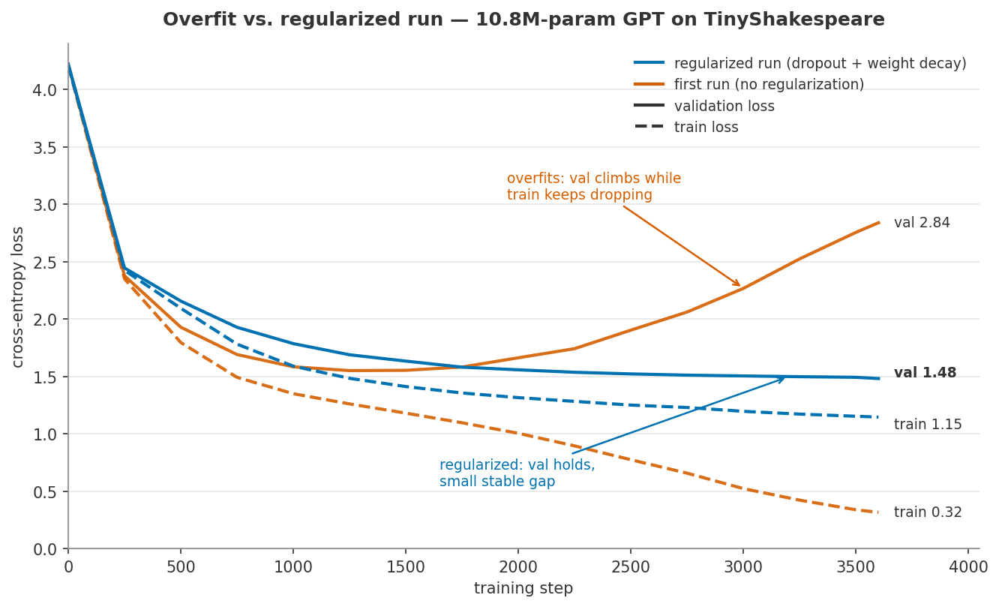

# nair-gpt

A decoder-only transformer (a tiny GPT) built from scratch in PyTorch, and
trained as a character-level language model that generates text one character at
a time. Multi-head self-attention, causal masking, and positional embeddings are
all implemented by hand.

**The attention mechanism and transformer block are written from scratch — no
`nn.MultiheadAttention`, no `nn.TransformerDecoderLayer`.** Understanding every
piece was the whole point; the commit history walks through the build phase by phase.

## Architecture

```
characters -> token embedding + positional embedding
           -> N x Transformer Block:
                x = x + MultiHeadAttention(LayerNorm(x))   # mix across positions
                x = x + FeedForward(LayerNorm(x))          # think per position
           -> final LayerNorm -> Linear -> logits over vocabulary
```

## Files

| File | Job |
|------|-----|
| `data.py` | text -> char/id lookup -> batches of `(x, y)` |
| `model.py` | the transformer (attention, blocks, the GPT) |
| `train.py` | the training loop |
| `sample.py` | generate text from a trained model |
| `plot_loss.py` | render the loss curve |

## Results

Trained the `big` preset on TinyShakespeare (1.1M characters, 65-character vocab)
on an Apple M-series GPU (MPS).

- **Parameters:** 10.8M (10,788,929)
- **Architecture:** 6 layers, 6 heads, 384-dim embeddings, 256-token context
- **Best validation loss:** **1.48** (train 1.15) — the random-guess baseline is `ln(65) = 4.17`
- **Training:** 3,600 steps, AdamW (lr 3e-4, weight decay 0.1), dropout 0.2, batch size 64

### Loss curve — and a lesson in overfitting



The **first** run had no regularization and overfit hard: train loss fell to 0.32
while validation loss bottomed near step ~1300 and then climbed to **2.84** — the
model was memorizing the training text instead of learning to generalize. Adding
**dropout (0.2) + weight decay (0.1)** and keeping the **best-validation
checkpoint** (early stopping) fixed it: in the second run, train and val stay
close and validation holds at **1.48**.

### Generation over training (gibberish → text)

Sampled with the same random seed at each checkpoint, so this is *pure model
improvement*, not luck of the draw:

**Step 0 (untrained):**
```
HiyadOs-kNKbgHqXBn,ili?.-gfuHn-eqrrbq,pKTx-TknH3f&;gVfiXDgrKcxeKDkluV-md
```

**Step 900 (val ~1.79):**
```
And to me an the manilian the and reater;
To-man, for some grecees in of day loove comple,

LADY:
My mane and him not, thou which he was deep.
```

**Step 1800 (val ~1.58):**
```
KING RICHARD III:
No, why, bed your charge to induct whose alive,
And terre for he lives.

LADY GREY:
Be and have privile in your country.
```

**Final (val 1.48):**
```
His dost to be him to provoked her rance;
To-morrow his faces counsel of days,
And constract us my back in the seat,
And hall the eyes of this new-man fool,
And revolted suppeth his eyes on trust him,
```

Real character names, `NAME:` speaker labels, line breaks, and verse rhythm all
emerge. The text is structurally Shakespeare, semantically dreamlike — about what
a 10.8M-parameter character model reaches on ~1M characters.

## Run it yourself

```bash
python3 -m venv .venv
source .venv/bin/activate
pip install -r requirements.txt

python data.py            # sanity-check the data pipeline
python model.py           # sanity-check attention + the full forward pass
python train.py big       # train (writes ckpt.pt + milestone snapshots)
python sample.py          # generate text from ckpt.pt
python plot_loss.py       # render loss_curve.png
```

Iterate fast on CPU with a smaller model: `python train.py small`.

## What building this lets me explain

- **Self-attention:** what Q/K/V are, and why scores are scaled by `√(head_size)`.
- **The causal mask:** why a language model must not see the future, and how setting future scores to `-inf` before softmax enforces it.
- **Multi-head:** why several small attentions beat one big one.
- **Residuals + LayerNorm:** what they do for training a deep stack.
- **Attention vs. FFN:** where the model mixes information *across* positions vs. thinks *per* position.
- **Overfitting:** diagnosing it from a train/val curve and fixing it with dropout, weight decay, and early stopping.
```

