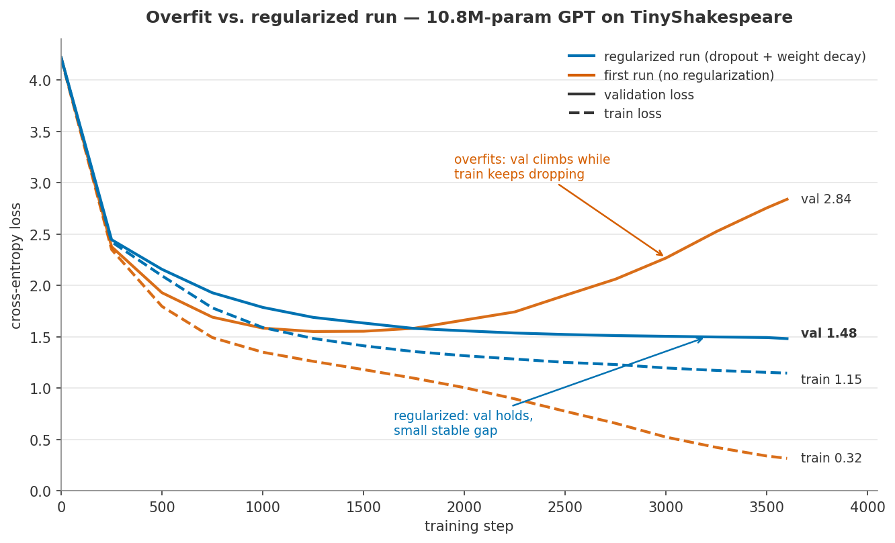

# nair-gpt

A decoder-only transformer (a tiny GPT) built from scratch in PyTorch, and
trained as a character-level language model that generates text one character at
a time. Multi-head self-attention, causal masking, and positional embeddings are
all implemented by hand.

## Architecture

```
characters -> token embedding + positional embedding
           -> N x Transformer Block:
                x = x + MultiHeadAttention(LayerNorm(x))   # mix across positions
                x = x + FeedForward(LayerNorm(x))          # think per position
           -> final LayerNorm -> Linear -> logits over vocabulary
```


## Results

Trained the `big` preset on TinyShakespeare (1.1M characters, 65-character vocab)
on an Apple M-series GPU (MPS).

- **Parameters:** 10.8M (10,788,929)
- **Architecture:** 6 layers, 6 heads, 384-dim embeddings, 256-token context
- **Best validation loss:** **1.48** (train 1.15) — the random-guess baseline is `ln(65) = 4.17`
- **Training:** 3,600 steps, AdamW (lr 3e-4, weight decay 0.1), dropout 0.2, batch size 64

### Loss curve 




### Generation over training (gibberish → text)

Sampled with the same random seed at each checkpoint, so this is *pure model
improvement*, not luck of the draw:

**Step 0 (untrained):**
```
HiyadOs-kNKbgHqXBn,ili?.-gfuHn-eqrrbq,pKTx-TknH3f&;gVfiXDgrKcxeKDkluV-md
```

**Step 900 (val ~1.79):**
```
And to me an the manilian the and reater;
To-man, for some grecees in of day loove comple,

LADY:
My mane and him not, thou which he was deep.
```

**Step 1800 (val ~1.58):**
```
KING RICHARD III:
No, why, bed your charge to induct whose alive,
And terre for he lives.

LADY GREY:
Be and have privile in your country.
```

**Final (val 1.48):**
```
His dost to be him to provoked her rance;
To-morrow his faces counsel of days,
And constract us my back in the seat,
And hall the eyes of this new-man fool,
And revolted suppeth his eyes on trust him,
```

Real character names, `NAME:` speaker labels, line breaks, and verse rhythm all
emerge. The text is structurally Shakespeare, semantically dreamlike — about what
a 10.8M-parameter character model reaches on ~1M characters.

## Run it yourself

```bash
python3 -m venv .venv
source .venv/bin/activate
pip install -r requirements.txt

python data.py            # sanity-check the data pipeline
python model.py           # sanity-check attention + the full forward pass
python train.py big       # train (writes ckpt.pt + milestone snapshots)
python sample.py          # generate text from ckpt.pt
python plot_loss.py       # render loss_curve.png
```

Iterate fast on CPU with a smaller model: `python train.py small`.
